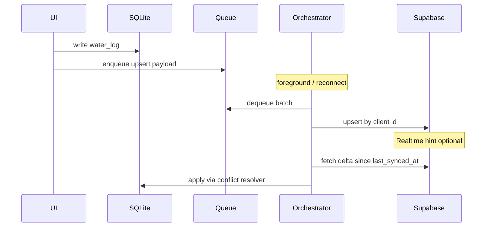

# Sync layer (Slice 0 pilot)

Offline sync for **water_logs** — queue-only push, delta pull, `sync_version` conflict resolution.

## Orchestration (v1)

## Conflict rules

1. Higher `sync_version` wins
2. If equal, later `updated_at` wins
3. Upserts are idempotent (keyed by client-generated `id`)
4. Deletes are soft (`deleted_at` set, row still upserted)

## Code locations

| Path | Role |
|------|------|
| `packages/shared/src/sync/conflict.ts` | `shouldApplyRemote`, `resolveConflict`, `nextLocalVersion` |
| `packages/shared/src/sync/orchestrator.ts` | `SyncOrchestrator` push/pull |
| `packages/shared/src/sync/waterLogs.ts` | Water log CRUD + queue helpers |
| `apps/mobile/src/sync/` | Mobile wiring (SQLite store + Supabase client) |

## Known v1 limitations

- Two devices editing the same row offline → one edit is lost
- Clock skew can mis-order rows when `sync_version` is equal

## Realtime

Realtime events should **only** trigger `runPull()` — never bypass the sync queue for local writes.
